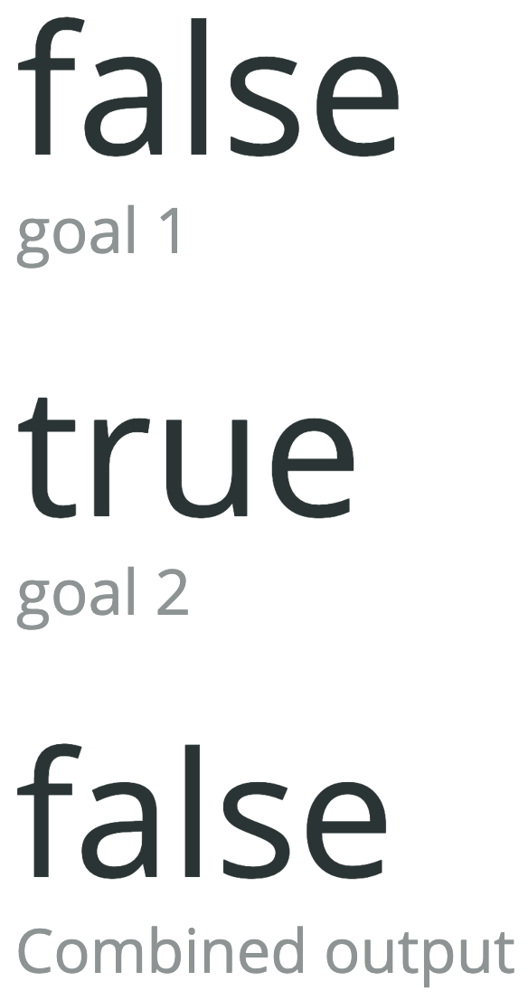

# Multiple Boolean Evaluator Visualization

This custom viz allows you to evaluate/combine multiple boolean values as a result of comparing each NRQL query result to its specified threshold.

For example, you have the following queries and thresholds to compare it to:

| NRQL                            | Threshold     | NRQL Result <= Threshold?   |
| ------------------------------- | ------------- | ----------------------------|
| SELECT average(`apm.service.cpu.usertime.utilization`) FROM Metric WHERE appName = 'Promo Service'                          | 30            | false                       |
| SELECT average(`apm.service.datastore.duration`) FROM Metric WHERE appName = 'Promo Service'                          | 10            | true                        |

Evaluating/combining the outputs above (which are `false` AND `true`) will produce a final result of `false`. If both are `true`, then the final result will also be `true`.



## Getting started

Run the following scripts:

```
npm install
npm start
```

Visit [https://one.newrelic.com/?nerdpacks=local](https://one.newrelic.com/?nerdpacks=local), navigate to Apps -> Custom Visualizations -> Multiple Boolean Evaluator, and :sparkles:

## Deploying this Nerdpack
To create a new uuid for the nerdpack so that you can deploy it to your account (profile is optional):

```
nr1 nerdpack:uuid -gf --profile=profile
```

Publish & Subscribe:

```
nr1 nerdpack:publish --profile=profile
nr1 nerdpack:deploy --profile=profile
nr1 nerdpack:subscribe --profile=profile
```
